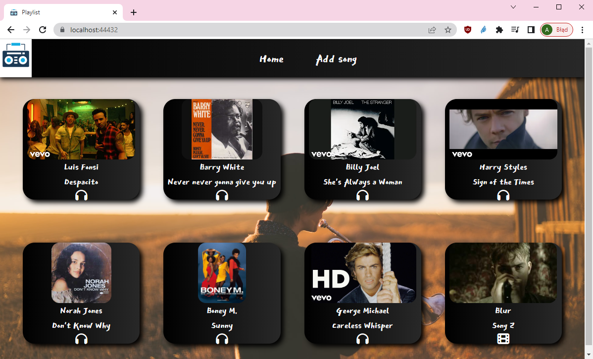
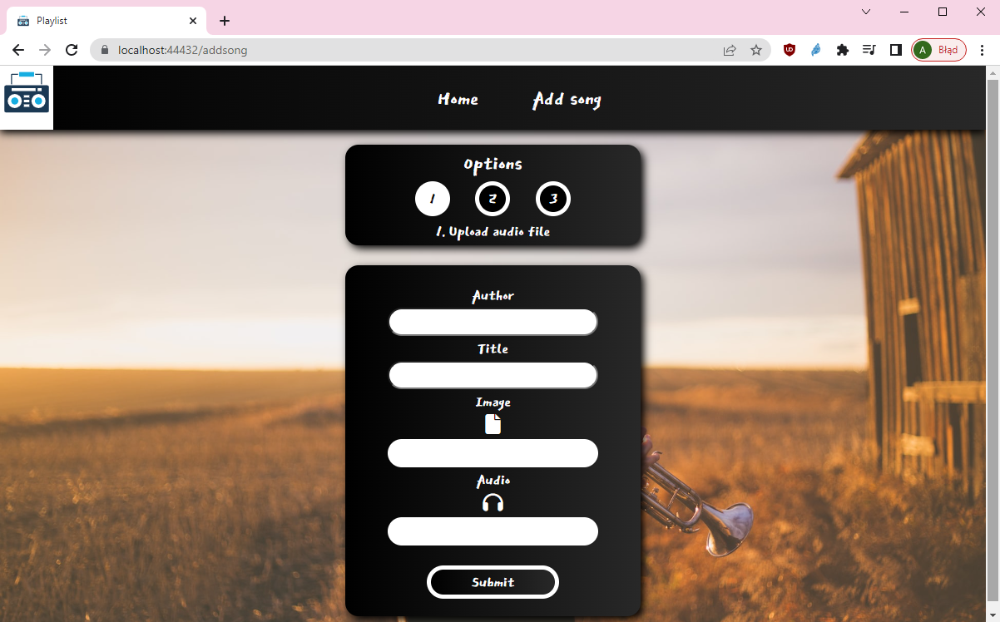
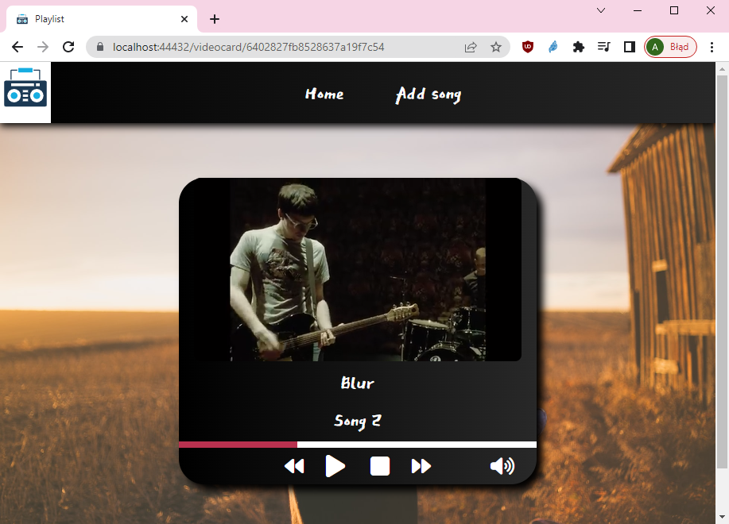

# Playlist

## Table of contents

- [General info](#general-info)
- [Technologies](#technologies)
- [Screenshots](#screenshots)

## General info

Playlist allows to store and listen to songs. They can by uploaded through audio files (e.g. <i>\*.mp3</i>) or video files (e.g. <i>\*.mp4</i>). There is an option to upload song via Youtube URL.

## Technologies

- ASP.NET 6 Web Api
- React
- MongoDB

## Screenshots

