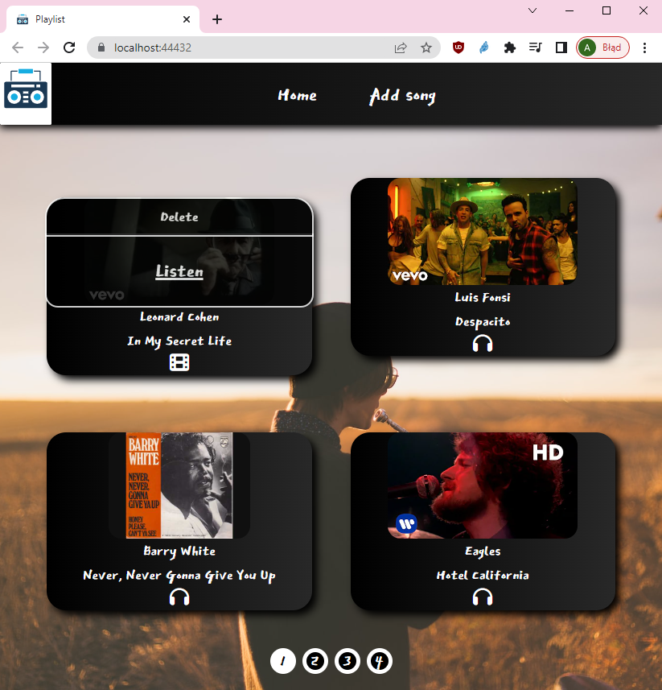

# Playlist

## Table of contents

- [Website URL](#website-url)
- [General info](#general-info)
- [Technologies](#technologies)
- [Screenshots](#screenshots)

## Website URL

https://playlist.arronax23.hostingasp.pl/

## General info

Playlist allows to store and listen to songs. They can be uploaded through audio files (e.g. <i>\*.mp3</i>) or video files (e.g. <i>\*.mp4</i>). There is also an option to upload song via Youtube URL.

## Technologies

- ASP.NET 6 Web Api
- React
- MongoDB

## Screenshots

